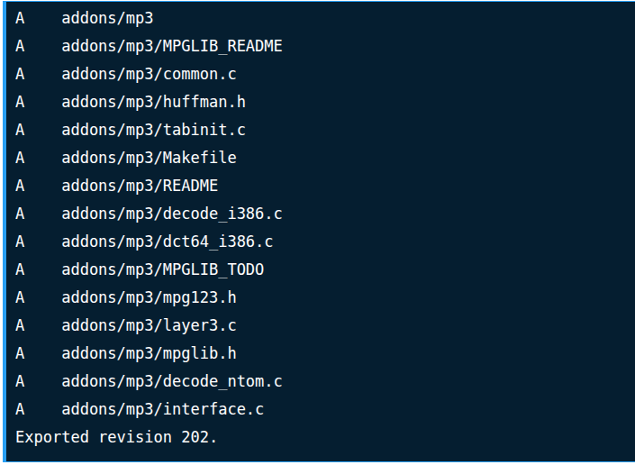

# ECB DOCUMENTATIONS

# Requirements: Ubuntu 20.04
# user: vrs
# password: vrs@123

Asterisk is a free and open source framework created by Sangoma for building communications applications both for small companies and for large scale use cases. Asterisk is a software based solution which turns your Old computer into a communications server that powers IP PBX systems, VoIP gateways, conference servers and other custom solutions. The solutions build by Asterisk powers call centers, carriers and government agencies worldwide.

In this blog post we’ll walk though the installation of Asterisk 18 LTS on Ubuntu 20.04 As of this writing the latest release of Asterisk is 18. Also note this is not a long term release and should not be used for production deployments that need Digium support for long years.

# Install Asterisk 18 LTS on Ubuntu 20.04

# 1. Update Ubuntu System

command: 
1. sudo apt update
2. sudo apt -y upgrade
3. [ -f /var/run/reboot-required ] && sudo reboot -f

# 2. Install Build Dependencies

After system is rebooted login and install all dependencies required to build Asterisk on Ubuntu Linux machine.

command:
1. sudo apt update
2. sudo add-apt-repository universe
3. sudo apt -y install git curl wget libnewt-dev libssl-dev libncurses5-dev subversion libsqlite3-dev build-essential libjansson-dev libxml2-dev  uuid-dev

The installation should only take few minutes if you have a decent internet connection.

# 3. Download Asterisk 18 tarball

You won’t find the latest release of Asterisk in the official system repositories. We’ll have to manually download the tarball and build the application from source.

For example, on Ubuntu 20.04, the version available in APT repositories is 16.

command: 
1. sudo apt policy asterisk

output: asterisk:
  Installed: (none)
  Candidate: 1:16.2.1~dfsg-2ubuntu1
  Version table:
     1:16.2.1~dfsg-2ubuntu1 500
        500 http://archive.ubuntu.com/ubuntu focal/universe amd64 Packages
        500 http://mirror.hetzner.de/ubuntu/packages focal/universe amd64 Packages
    
Use wget command to download archive file.

command:
1. sudo su
2. cd ~
3. wget http://downloads.asterisk.org/pub/telephony/asterisk/asterisk-18-current.tar.gz

Extract the file with tar.
4. tar xvf asterisk-18-current.tar.gz

Run the following command to download the mp3 decoder library into the source tree.

5. cd asterisk-18*/
6. contrib/scripts/get_mp3_source.sh

Expected command execution output:

Ensure all dependencies are resolved:
7. sudo contrib/scripts/install_prereq install

You should get a success message at the end:

# 4. Build and Install Asterisk 18

After installation of dependencies you should be ready to build Asterisk 18 from the source we downloaded.

Run the configure script to satisfy build dependencies.

command: 
1. ./configure

A success should have an output like below:

Setup menu options by running the following.

2. make menuselect

Use arrow keys to navigate, and Enter key to select.

Select Addons to enable.

Enable Core sound modules you want to use.

You can also add additional MOH packages you want to use.

Do the same for Extra Sound Packages.

You can also go through the other menus and select options you see fit for your use case.

When done run the following command to build Asterisk 18 on Ubuntu 20.04.

command:
1.make

Here is my successful build output:

This is the command you’ll run to install Asterisk 18 on Ubuntu:

2. sudo make install

Sample output:

But used this 3 commands:

3. sudo make samples
4. sudo make config
5. sudo ldconfig

# 5. Configure and Start Asterisk Service

Create a separate user and group to run asterisk services, and assign correct permissions:
command:

1. sudo groupadd asterisk
2. sudo useradd -r -d /var/lib/asterisk -g asterisk asterisk
3. sudo usermod -aG audio,dialout asterisk
4. sudo chown -R asterisk.asterisk /etc/asterisk
5. sudo chown -R asterisk.asterisk /var/{lib,log,spool}/asterisk
6. sudo chown -R asterisk.asterisk /usr/lib/asterisk
7. sudo chmod -R 750 /var/{lib,log,run,spool}/asterisk /usr/lib/asterisk /etc/asterisk

Set Asterisk default user to asterisk:

8. sudo vim /etc/default/asterisk
#Uncomment AST_USER and AST_GROUP to look like below
AST_USER="asterisk"
AST_GROUP="asterisk"

9. sudo vim /etc/asterisk/asterisk.conf
runuser = asterisk ; The user to run as.
rungroup = asterisk ; The group to run as.

Restart asterisk service after making the changes:
10. sudo systemctl restart asterisk

Enable asterisk service to start on system  boot:
11. sudo systemctl enable asterisk

Check service status to see if it is running.
12. systemctl status asterisk

● asterisk.service - LSB: Asterisk PBX
     Loaded: loaded (/etc/init.d/asterisk; generated)
     Active: active (running) since Fri 2023-08-14 12:04:41 CEST; 9s ago
       Docs: man:systemd-sysv-generator(8)
      Tasks: 82 (limit: 4567)
     Memory: 44.6M
     CGroup: /system.slice/asterisk.service
             └─54142 /usr/sbin/asterisk -U asterisk -G asterisk

Verify you can connect to Asterisk Command Line interface.

13. sudo asterisk -rvv

 Asterisk 18.10.0, Copyright (C) 1999 - 2021, Sangoma Technologies Corporation and others.
 Created by Mark Spencer markster@digium.com
 Asterisk comes with ABSOLUTELY NO WARRANTY; type 'core show warranty' for details.
 This is free software, with components licensed under the GNU General Public
 License version 2 and other licenses; you are welcome to redistribute it under
 certain conditions. Type 'core show license' for details.
 Running as user 'asterisk'
 Running under group 'asterisk'
 Connected to Asterisk 18.1.1 currently running on asterisk (pid = 107650)
 asterisk*CLI> exit
 Asterisk cleanly ending (0).
 Executing last minute cleanups

# 6. Changes in files

command:

If devices not shown after used command: sudo asterisk -rvvvvv, sip show peers;, changes in files.

1. cd /etc/asterisk
2. sudo nano modules.conf

Look for:
-> ; chan_sip.so

and uncomment it:
-> load => chan_sip.so

changes in sip.conf, extensions.conf

1. cd /etc/asterisk
2. sudo mv sip.conf sip.conff
3. sudo nano sip.conf 
link of sip.conf: [text](sip.conf)

4. sudo mv extensions.conf extensions.conff
5. sudo nano extensions.conf
link of extensions.conf: [text](extensions.conf)

# Restart services.

1. sudo systemctl restart asterisk;

If you have an active ufw firewall, open http ports and ports 5060,5061:

2. sudo ufw allow proto tcp from any to any port 5060,5061

You now have Asterisk 18 installed and working on Ubuntu 20.04 Linux server.

# 7. MYSQL DATABASE CONNECTIVITY SETUP:

1. Install Required Packages

Ensure the necessary software packages are installed on your Asterisk server.

2. sudo apt update
3. sudo apt install -f
4. sudo apt install unixodbc unixodbc-dev libmyodbc odbcinst mysql-server

If error libmyodbc installations in ubuntu:
5. cd /home
6. sudo su
7. wget http://archive.ubuntu.com/ubuntu/pool/main/e/eglibc/multiarch-support_2.19-0ubuntu6_amd64.deb
8. dpkg -i multiarch-support_2.19-0ubuntu6_amd64.deb
9. wget http://archive.ubuntu.com/ubuntu/pool/main/m/mysql-5.5/libmysqlclient18_5.5.35+dfsg-1ubuntu1_amd64.deb
10. dpkg -i libmysqlclient18_5.5.35+dfsg-1ubuntu1_amd64.deb
11. wget http://archive.ubuntu.com/ubuntu/pool/universe/m/myodbc/libmyodbc_5.1.10-3_amd64.deb
12. dpkg -i libmyodbc_5.1.10-3_amd64.deb
13. sudo systemctl restart asterisk;

Edit files for connectivity:

14. mysql -u root -p

mysql commands setup table:
1. CREATE DATABASE asterisk;
2. USE asterisk;
3. CREATE TABLE cdr (
    calldate datetime NOT NULL,
    clid varchar(80) NOT NULL,
    src varchar(80) NOT NULL,
    dst varchar(80) NOT NULL,
    dcontext varchar(80) NOT NULL,
    channel varchar(80) NOT NULL,
    dstchannel varchar(80) DEFAULT NULL,
    lastapp varchar(80) NOT NULL,
    lastdata varchar(80) NOT NULL,
    duration int(11) NOT NULL,
    billsec int(11) NOT NULL,
    disposition varchar(45) NOT NULL,
    amaflags int(11) NOT NULL,
    accountcode varchar(20) DEFAULT NULL,
    uniqueid varchar(32) NOT NULL,
    userfield varchar(255) DEFAULT NULL,
    primary key (calldate, uniqueid)
);
4. FLUSH PRIVILEGES;
5. EXIT;

15. sudo nano /etc/odbc.ini

edit: [asterisk-connector]
Description = Asterisk MySQL ODBC Connection
Driver = MySQL
Server = 127.0.0.1
Database = asterisk
User = root
Password = vrs@123
Port = 3306
Option = 3

16. sudo nano /etc/odbcinst.ini
Edit: [MySQL]
Description = ODBC for MySQL
Driver = /usr/lib/x86_64-linux-gnu/odbc/libmyodbc.so  # Adjust path if necessary
Setup = /usr/lib/x86_64-linux-gnu/odbc/libodbcmyS.so # Adjust path if necessary
FileUsage = 1

output: odbcinst -q -d

Test the ODBC Connection
Run the following command to ensure ODBC can connect to MySQL:

17. isql -v asterisk-connector
+---------------------------------------+
| Connected!                            |
|                                       |
| sql-statement                         |
| help [tablename]                      |
| quit                                  |
+---------------------------------------+

If successful, you should see a SQL prompt. Otherwise, troubleshoot the configuration files.

18. sudo nano /etc/asterisk/res_odbc.conf
edit: [asterisk]
enabled => yes
dsn => asterisk-connector
username => root
password => vrs@123
pre-connect => yes

Configure the CDR System

19. sudo nano /etc/asterisk/cdr_adaptive_odbc.conf

Add the CDR configuration:
edit: [asterisk]
connection => asterisk
table => cdr
alias start => calldate

Set Up the MySQL Database
Log in to MySQL and create the CDR database and table:

20. sudo systemctl restart asterisk

[Note]: change bind address in mysql.conf for remote access

21. sudo nano /etc/mysql/mysql.conf.d/mysqld.cnf
bind-address = 127.0.0.1
change to
bind-address = 0.0.0.0

22. sudo systemctl restart mysql

#8. Sockets data fetch from 50050 port ecb and sends to the 50052 port windows setup.

1. sudo ufw allow 50052/tcp
2. sudo ufw allow 50052

code: [text](sensor.py)

#9. FTP configurations.

